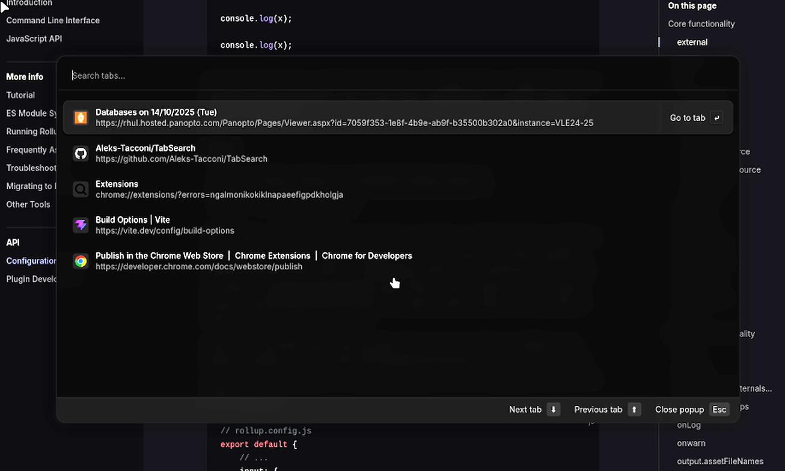

# Tab Search

Improve productivity and reduce search fatigue with a simple fuzzy finder for your tabs.



## Setup and Install

1. Clone the repository

  ```sh
  git clone https://github.com/Aleks-Tacconi/TabSearch.git
  ```

2. Navigate to the repository

  ```sh
  cd TabSearch
  ```

3. Install dependencies

  ```sh
  npm install
  ```

4. Build the project

  ```sh
  npm run build
  ```

5. Go to extensions page on desired chromium based browser, enable developer mode, select "Load unpacked" and select TabSearch/dist as the directory. The extension will now be installed

> Note: Already open pages will have to be reloaded in order for the popup to work on them.

> Note: This extensions also does not work on internal pages (chrome://... or brave://...)

## TODO

- Support for setting custom keybindings 
- More actions for tab manipulation
